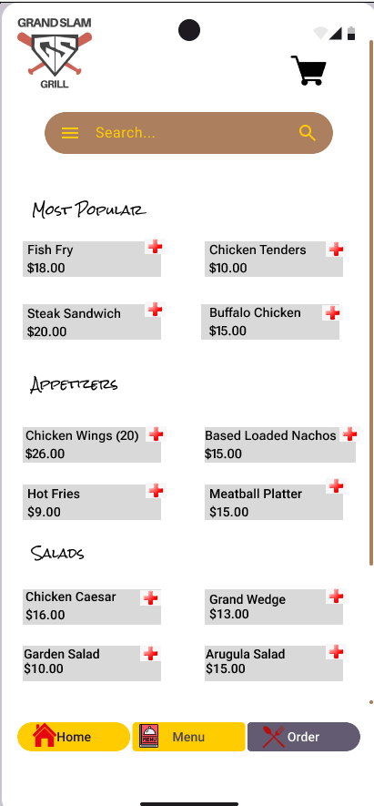
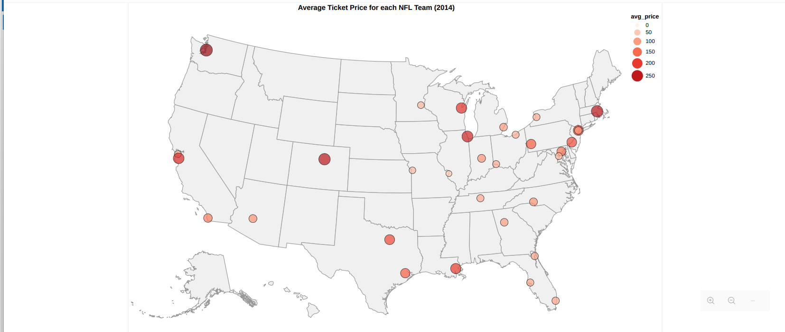

# hunterthompson247.github.io
This is my portfolio for all of my CS257 Labs and Prototypes.
# Designing For Different Dimensions and Others
  

[See Full Design](https://www.figma.com/design/m2aL0AjmpBVDhMtSY3aIRX/CS257-Lab?t=IJX1CKTcdlKPItsn-0)

The aim of this design was to take a website from an existing organization and redesign it for phones. I also had to choose an audience to design for, and I chose students at St. Bonaventure due to the close proximity to Grand Slam Grill. If you click to see the full design, you will be able to interact with the prototype.

# Design for Understanding
 

In this project, we had to choose an interesting data set and use what we learned in the class about perceptual pathways in our brain to design visualizations for the data. We decided to use the average ticket price for each team in the NFL in 2014 as our data set. The data itself is quite simple and we wanted to find interesting ways we could look at it. The top visualization was our persuasive visualization as a U.S. Map usually triggers U.S. citizens to be curious. The other visualization is more clear, and it uses a tree map which wasn't a visualization I had seen much of before. 

# Designing for Collaboration
  

[See Full Design](https://www.figma.com/design/AEi9jeyxlj4ySPvwUuQ5ur/CS-257-Design-For-Collaboration?t=IJX1CKTcdlKPItsn-0)

This was my most in depth project. For this design, we had to work with our local college radio station and help them implement ideas they had for their radio station app. We attmepted to implement as many of their suggestions as we could. This is also my most interactive prototype, and has many more pages than the three shown. 

